Automating Kerberos Authentication for Data Lake Access: A Zero‑Touch, Secure Credential Management Story

Introduction

In many data‑driven organisations, the data lake (often a Hadoop cluster) remains the central repository for analytics and machine learning workloads. Access to this data lake is typically protected by Kerberos – a robust network authentication protocol. However, Kerberos comes with a well‑known operational overhead: users must manually obtain a ticket using kinit before they can run any job. Worse, tickets expire. When a long‑running analytics process suddenly fails because the Kerberos ticket has timed out, it disrupts productivity and creates a poor user experience.

We recently faced this exact challenge in our on‑premises Data Science Workbench (DSW) environment. Our goal was to eliminate manual kinit steps and remove the risk of ticket expiration blocking critical analysis. This post describes the solution we built, with a special focus on the hardest part: securely storing user credentials so that we can automatically request and renew Kerberos tickets on behalf of users.

What We Achieved

We successfully designed and implemented a fully automated Kerberos ticket management system that:

· Removes manual kinit completely – Users simply log into the DSW with their LDAP credentials. From that point on, every notebook they create automatically gets a valid Kerberos ticket without any additional user action.
· Eliminates ticket expiration interruptions – The system continuously monitors the ticket’s lifetime and renews it automatically before it expires. Long‑running analytics jobs (even those lasting days) run uninterrupted.
· Protects credentials with HashiCorp Vault – User passwords are never stored in plain text or in application logs. Instead, they are encrypted and stored inside HashiCorp Vault, which acts as our secure credential broker.
· Drastically reduces production support burden – Kerberos‑related issues have dropped to zero in production. This was previously the most frequent type of user complaint, and after the rollout, our IT team saw more than a 50% reduction in overall production support requests.
· Saves valuable user time every day – Every active user saves between 1 and 5 minutes per day by not having to manually kinit. With ~300 daily active users and a total user base of 1,600, this translates into roughly 10–25 hours saved every single day.
· Improves onboarding experience – New users no longer need to learn about Kerberos, kinit, or ticket expiration before they can start working. The platform “just works”, reducing cognitive overhead and accelerating time‑to‑insight.
· Solves a long‑standing creative challenge – Preventing ticket expiration from killing long‑running jobs has been a difficult problem for years. By moving the renewal logic to the client side and integrating it seamlessly with the notebook lifecycle, we have achieved a truly elegant and reliable solution.

Key Metrics at a Glance

Metric Before (Manual) After (Automated) Improvement
Monthly Kerberos‑related production issues ~15–20 0 100% reduction
Overall production support requests (from users) Baseline >50% reduction Major operational relief
Daily user time spent on kinit 1–5 min per user 0 Saves 10–25 hours/day for 300 active users
New user onboarding steps (Kerberos related) 2–3 (explain kinit, ticket expiry, renewal) 0 Frictionless onboarding
Long‑running job failures due to ticket expiry Frequent None 100% reliability for job duration

The following bar chart visualises the most dramatic impact: elimination of production issues and the drastic drop in support tickets.

```mermaid
gantt
    title Production Impact Before vs After Automation
    dateFormat HH:mm
    axisFormat %H:%M
    section Monthly issues
    Kerberos ticket expiry (manual) : 00:00, 20m
    Kerberos ticket expiry (auto) : 00:00, 0m
    section Support tickets
    Other issues (unchanged) : 00:00, 10m
    Kerberos-related tickets (manual) : 00:00, 15m
    Kerberos-related tickets (auto) : 00:00, 0m
```

(Note: The length of each bar is proportional to the relative volume. Zero‑length bars indicate complete elimination.)

How We Did It

The following diagram illustrates the end‑to‑end flow:

```mermaid
flowchart LR
    A[🔐 Login FC DSW on Prem] --> B[👤 Enter Username and Password]
    B --> C[🔍 LDAP Authentication]
    C --> D{✅ Valid?}
    
    D -- Yes --> E[🔁 Store encrypted credential into Hashicorp Vault]
    E --> F[✅ Return Login Success]
    F --> G[📓 User create Jupyter Notebook on FC DSW on Prem]
    
    D -- No --> H[❌ Invalid Username or Password]
    H --> I[⚠️ Return Error]
    
    G --> J[🔑 Application retrieve encrypted credential from Hashicorp Vault]
    J --> K[🎫 Apply for Kerberos ticket from KDC automatically]
    K --> L{⏳ Kerberos Ticket Expired?}
    
    L -- Yes --> M[🔄 Renew Kerberos ticket automatically]
    M --> N[📡 User access Hadoop Cluster with valid Kerberos authentication]
    
    L -- No --> N
    
    N --> L

    classDef input fill:#d4f1f9,stroke:#0077b6,stroke-width:2px,color:#000;
    classDef process fill:#fff3cd,stroke:#ffc107,stroke-width:2px;
    classDef decision fill:#ffe5b4,stroke:#f4a261,stroke-width:2px,shape:rhombus;
    classDef error fill:#ffcccc,stroke:#d9534f,stroke-width:2px;
    classDef success fill:#d4edda,stroke:#28a745,stroke-width:2px;
    
    class A,B,C input;
    class D,L decision;
    class H,I error;
    class E,F,G,J,K,M,N success;
```

Let me walk you through the key phases.

1. User Login & LDAP Validation

The user enters their staff ID and password into the DSW login page. The application validates these credentials against the corporate LDAP directory. Only after a successful LDAP check do we proceed.

2. Secure Credential Storage (The Hardest Part)

Challenge: To later request a Kerberos ticket from the KDC, we need the user’s plaintext password (or a derived key). But storing passwords anywhere – even temporarily – is dangerous.

Solution: We integrated HashiCorp Vault as our secret store. Upon successful LDAP authentication, the application encrypts the user’s password (using Vault’s transit engine) and stores the resulting ciphertext in Vault’s key‑value store. The plaintext password never hits disk, logs, or environment variables. Only the encrypted blob is kept, and it can only be decrypted by an authorised service with the right Vault policies.

3. Automatic Kerberos Ticket Acquisition

When a user creates a Jupyter notebook, the backend application:

· Retrieves the encrypted credential from Vault.
· Decrypts it (again, inside Vault or via a tightly controlled decryption call).
· Uses the plaintext password to perform a kinit against the KDC, obtaining an initial ticket.
· Stores the ticket in the notebook’s session (or a dedicated credential cache).

All of this happens in milliseconds and is completely transparent to the user.

4. Ticket Lifetime Monitoring & Auto‑Renewal

Kerberos tickets have a finite lifetime (typically 8–24 hours). Our solution does not stop there. After a ticket is obtained, a background process continuously checks the ticket’s remaining validity. When the ticket is about to expire (e.g., with less than 30 minutes left), the system automatically uses the same stored Vault credential to request a renewal from the KDC. The user’s notebook session never loses its ability to read from the data lake.

The flowchart shows this as a loop: after accessing Hadoop, we return to the “Kerberos Ticket Expired?” check. In practice, this is implemented as a lightweight timer inside the notebook’s pod or as a side‑car container.

5. Accessing the Data Lake

With a valid (and automatically renewed) ticket, the user’s notebook can read from and write to the Hadoop cluster just as if they had manually run kinit once. The difference is that they never have to think about tickets again – and long‑running jobs survive for days or weeks without interruption.

Conclusion

By automating Kerberos ticket management and delegating credential storage to HashiCorp Vault, we delivered a solution that:

· Boosts developer productivity – No more manual kinit before every analysis. Every active user saves 1–5 minutes per day, adding up to over 300 hours per month.
· Increases reliability – Long‑running jobs no longer die from ticket expiration. Production issues related to Kerberos have dropped to zero.
· Strengthens security – User passwords are never exposed; they are encrypted at rest inside Vault with strict access controls.
· Reduces operational cost – The IT team saw more than a 50% reduction in overall production support requests, because Kerberos issues were the most common ticket type.
· Delights users – New hires can start working immediately without learning about Kerberos. Existing users no longer experience sudden job failures. The platform becomes invisible – in the best sense.

The most challenging part – safely storing and retrieving secrets to perform kinit on behalf of users – turned out to be a perfect use case for HashiCorp Vault. The entire integration took us a few weeks to design, implement, and test. Today, our Data Science Workbench users enjoy a “login once, analyse freely” experience, completely unaware of the Kerberos machinery running behind the scenes.

If you are struggling with similar authentication bottlenecks in a Kerberos‑protected environment, consider this pattern: LDAP + Vault + automated ticket renewal. It works, and your users will thank you.

---

Have you built a similar automation? Or are you facing challenges with Kerberos ticket expiry in your data platform? Let’s discuss in the comments.